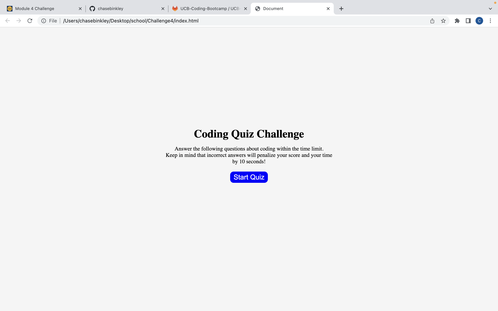

# Challenge4-CodeQuiz

## Description

I have created a code quiz that when started the user is presented with a timer and multiple choice questions. If the user picks the correct answer they will receive a congratulative message and will progress to the next question, but if they choose the wrong answer they will receive a negative comment and time will be deducted from the timer lowering the users score. The game ends when the user answers all the questions or the timer runs out, at which point the user will be given the opportunity to save their initials and score, clear the high score, or start the game all over again.

### Links

Deployed Site URL: []

#### Screenshot

